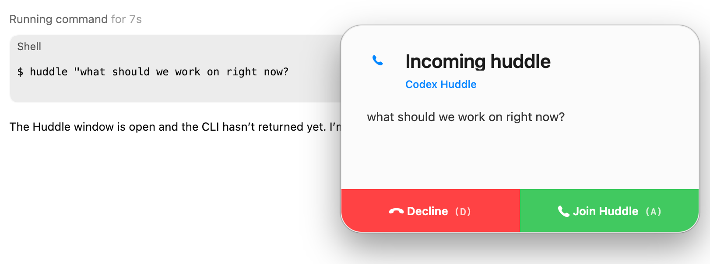

# Huddle



Open-source, local-first spoken huddles for coding agents.

This includes a macOS CLI plus the Swift popup/recording helper. Users run everything locally and provide their own API tokens for speech-to-text and text-to-speech.

## What It Does

- opens a lightweight Swift popup on macOS
- speaks the agent's question with ElevenLabs
- records your spoken reply locally
- transcribes the recording with Groq
- returns plain text back to the terminal for the agent

## Requirements

- macOS
- Node `22.14+`
- `pnpm`
- `swift`
- a Groq API key for transcription
- an ElevenLabs API key for spoken prompt playback

If you only provide a Groq key, recording and transcription still work, but the
prompt will not be spoken aloud.

## Install

```bash
corepack enable
pnpm install
pnpm build
```

To use the local launcher from anywhere:

```bash
ln -sf "$PWD/huddle" /usr/local/bin/huddle
```

## Configure Tokens

Copy [`.env.example`](/Users/zevstravitz/dev/agent-huddle/.env.example) to
`.env` and fill in your local tokens:

```bash
cp .env.example .env
```

Supported environment variables:

```bash
GROQ_API_KEY=...
ELEVENLABS_API_KEY=...
HUDDLE_VOICE=...
HUDDLE_SPEECH_SPEED=1.12
HUDDLE_TRANSCRIBE_MODEL=whisper-large-v3-turbo
HUDDLE_CLEANUP_MODEL=llama-3.1-8b-instant
HUDDLE_CLEANUP_MODE=code
```

Compatibility aliases are also accepted:

- `GROK_API_KEY` maps to the Groq transcription key
- `ELEVENLABS_TOKEN` maps to the ElevenLabs key
- `--grok-token` maps to `--groq-api-key`

## Usage

Check local readiness:

```bash
huddle status
```

Run a spoken huddle with environment variables:

```bash
huddle "I traced the migration flow and narrowed it to one compatibility decision. Should I keep the fallback?"
```

Pass tokens directly on the command line instead of using `.env`:

```bash
huddle "What should I do next?" \
  --groq-api-key "$GROQ_API_KEY" \
  --elevenlabs-api-key "$ELEVENLABS_API_KEY"
```

Reuse an existing popup window:

```bash
huddle "Follow-up question" -c <conversation_id>
```

Close an open popup window:

```bash
huddle close -c <conversation_id>
```

## Agent Integration

Add a short instruction telling your agent when to request a spoken huddle and
to treat stdout from `huddle` as the user's answer.

Recommended project instruction:

```text
When you need input or clarification, call `huddle`.

If a quick answer would unblock you, call instead of guessing.

Keep each huddle prompt short and specific. Briefly say what you have done so far, then ask for the one decision or clarification you need. Do not turn it into a long status dump.

Treat the command output as the user's answer.
If it prints `[huddle declined]` or `[huddle cancelled]`, continue with a normal typed follow-up instead of retrying repeatedly.
If it prints `[huddle missed]`, proceed with your best reasonable assumption instead of blocking on a reply.
```

## Local Config File

Optional local config files are still supported:

- `huddle.config.json`
- `.huddle.json`
- `agent-voice.config.json`
- `.agent-voice.json`
- `~/.huddle/config.json`

Example:

```json
{
  "voice": {
    "defaultVoiceId": "analyst",
    "speakingRate": 1.1,
    "modelId": "eleven_multilingual_v2",
    "outputFormat": "mp3_44100_128"
  },
  "persona": {
    "default": "pair-programmer",
    "presets": [
      {
        "id": "pair-programmer",
        "label": "Pair Programmer",
        "description": "Balanced default voice behavior for huddles.",
        "voiceId": "analyst"
      }
    ]
  }
}
```

## Packaging

Build release assets:

```bash
pnpm huddle:build:release
```

Build a macOS installer package:

```bash
pnpm huddle:package:macos
```

Build Homebrew release artifacts:

```bash
pnpm huddle:package:homebrew
```

## License

MIT. See [LICENSE](/Users/zevstravitz/dev/agent-huddle/LICENSE).
